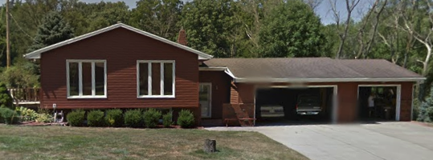
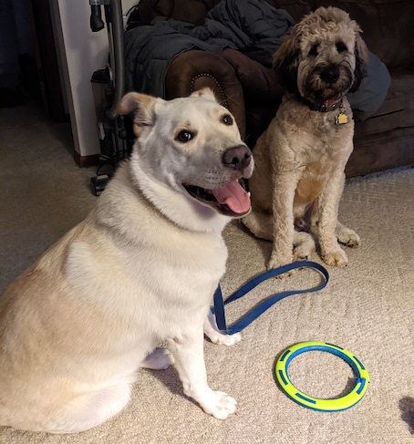
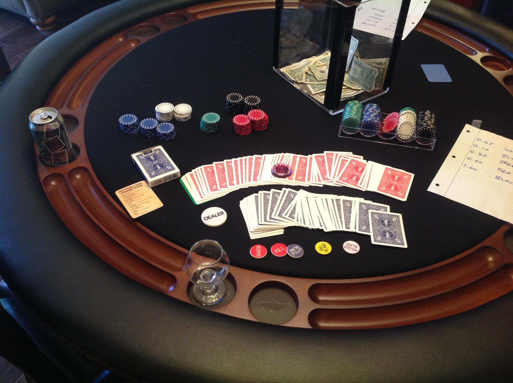

% Poker @ Jay & Steph's

# Sat Feb 8, 2025. 7:30pm - whenever

Overflow! Nick's poker games are packed now, 
Let's play Texas Hold 'Em!

[12238 N 40th St, Omaha NE 68112](https://goo.gl/maps/7jy3mT22T7wADNtG7)

Lost? Call Jay at 402-598-7782

## COVID-19, Influenza, and RSV

[Douglas County Stats](https://www.douglascountyhealthportal.com/).
If anyone in your household is not feeling well recently
please don't come this month. There's always next month. 🙂

We're keeping the invite / RSVP list small. 6-9 total players over the
course of however many hours. We love you, but viruses suck.

## Huey

Our ~110 pound dog is a whole thing. He was rescued from an abusive situation, with early trauma.
He'll be separated from the poker room by a gate, or kenneled if he can't relax and behave himself.
Don't try to reach for him.
He loves string cheese. With patience and bribery he can be your friend if you want. 🙂

## Poker

* All skill levels welcome! Or just come and hang out.
* No limit Texas hold-em. 10/20 cent blinds. $20 buy-in. Bringing small bills is appreciated. CashApp, Venmo, PayPal, Zelle available. Table stakes. No rake. Buy in as many times as you want. Cash out whenever you want.
* If you don't know how to play Texas hold-em, [it's easy](http://en.wikipedia.org/wiki/Texas_Hold%27em#Rules) We'll walk you through it. 🙂
* No need to bring anything. I stock some amber / dark beers and añejo tequila. If you want an actual meal for yourself, bring it. The house might have zero food in it, or I might have bought way too much food / snacks.

